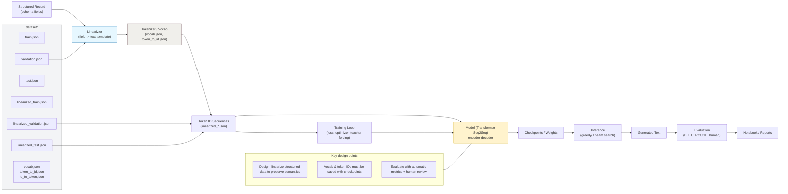

# NLG — Natural Language Generator

## Purpose
This repository contains the project for Assignment 1 (NLG) used for learning sequence-to-text generation and dataset linearization. It includes the dataset exports, a Jupyter notebook with experiments, and supporting PDFs.

## What you'll find
- `Group_188_PS2_Submission.ipynb` — main notebook with experiments and usage examples.
- `dataset/` — dataset files and token mappings (JSON).
- `Assignment_PS2_NLG.pdf`, `Group_188_PS2_Submission.pdf` — assignment and deliverables.

## Project Structure

- `dataset/` — raw and linearized JSON files:
  - `train.json`, `validation.json`, `test.json` — original splits
  - `linearized_train.json`, `linearized_validation.json`, `linearized_test.json` — linearized inputs for NLG models
  - `vocab.json`, `id_to_token.json`, `token_to_id.json` — vocabulary and mappings

## Quickstart

1. Create and activate a Python virtual environment (macOS/Linux):

```bash
python3 -m venv .venv
source .venv/bin/activate
```

2. Install common tools (adjust as needed):

```bash
pip install jupyter numpy pandas
```

3. Open the notebook:

```bash
jupyter notebook Group_188_PS2_Submission.ipynb
```

Notes: If you rely on a specific model or library (PyTorch/Transformers), add those to your environment before running training/evaluation cells.

## Usage
- The notebook demonstrates data loading, linearization, and baseline experiments. Use the `dataset/` JSON files as inputs for any preprocessing scripts or model training.

## Architecture Diagram



## Lessons Learned
- Linearizing structured inputs simplifies mapping input fields to target text.
- Maintaining token<->id mappings ensures reproducible decoding.
- Jupyter notebooks are useful for iterative experiments and visualizing intermediate outputs.

## Next steps (suggested)
- Add a `requirements.txt` with exact dependencies.
- Create modular scripts for preprocessing, training, and evaluation.
- Add unit tests for data loading and linearization logic.

## Technical Architecture (problem-focused)

**Problem statement:** Convert structured records (schema + JSON splits) into fluent natural-language descriptions using sequence-to-text generation.

- **Core components:**
  - **Data storage:** [dataset/train.json](dataset/train.json), [dataset/validation.json](dataset/validation.json), [dataset/test.json](dataset/test.json), plus linearized files in `dataset/`.
  - **Preprocessing & linearization:** Notebook-driven scripts that normalize records and produce `linearized_*.json` for model inputs. See [Group_188_PS2_Submission.ipynb](Group_188_PS2_Submission.ipynb).
  - **Tokenization & vocab:** `vocab.json`, `token_to_id.json`, `id_to_token.json` provide deterministic token <-> id mappings used at encoding/decoding.
  - **Model:** Sequence-to-sequence or Transformer model that consumes tokenized linearized inputs and generates target text.
  - **Evaluation:** Automatic metrics (BLEU / ROUGE / exact match) and human inspection recorded in notebooks/PDFs.

- **Data flow (high level):**
  1. Raw JSON splits loaded from `dataset/` by Data Loader.
  2. Preprocessing normalizes values and resolves missing fields.
  3. Linearizer converts structured records into a textual sequence per example (stored as `linearized_*.json`).
  4. Tokenizer maps tokens to IDs using `token_to_id.json` and `vocab.json`.
  5. Model trains on token ID sequences → predicted token sequences → decode using `id_to_token.json` to text.
  6. Evaluate predictions; store results in notebook outputs / result files.

- **Modeling details & configuration:**
  - Typical choices: Transformer encoder-decoder, cross-entropy loss, Adam optimizer, teacher forcing during training.
  - Important hyperparameters to track: learning rate, batch size, max sequence length, vocabulary size, random seed.
  - Keep config in a single file (suggestion): `config.yaml` (not included yet) to ensure reproducibility.

- **Reproducibility & artifacts:**
  - Save `vocab.json`, `token_to_id.json`, and `id_to_token.json` alongside model checkpoints.
  - Log seeds, library versions, and metrics inside the notebook or an experiment log file.

- **Deployment / inference (suggested):**
  - Small inference script: load tokenizer + model checkpoint, accept JSON input or single record, return generated text.
  - Containerize environment or provide a `requirements.txt` for reproducible runs.

**Files mapping (quick):**
- Notebook: [Group_188_PS2_Submission.ipynb](Group_188_PS2_Submission.ipynb)
- Dataset folder: [dataset/](dataset)
- Linearized inputs: [dataset/linearized_train.json](dataset/linearized_train.json)
- Vocab & mappings: [dataset/vocab.json](dataset/vocab.json), [dataset/token_to_id.json](dataset/token_to_id.json), [dataset/id_to_token.json](dataset/id_to_token.json)


## License & Contact
Feel free to reach me at iosdeveloper.ipa@gmail.com (PavanKumarArepu).
